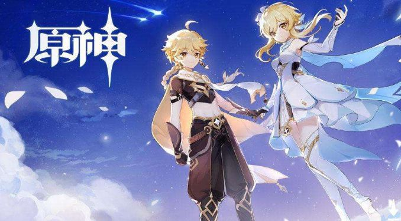
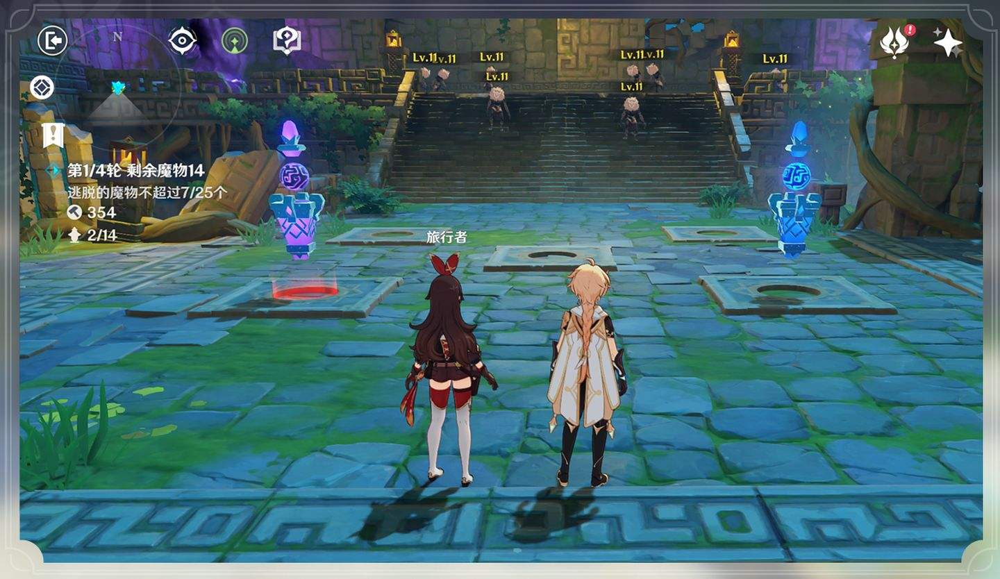
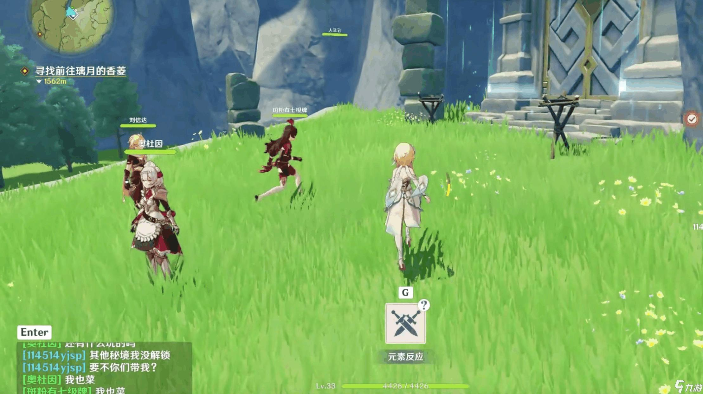
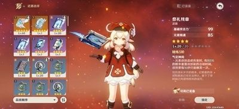
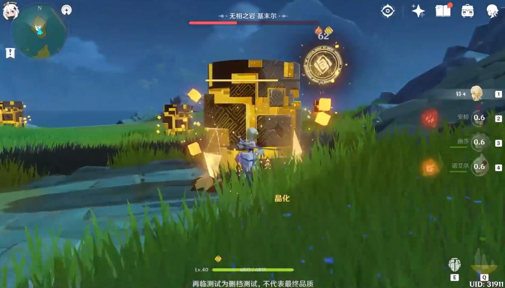
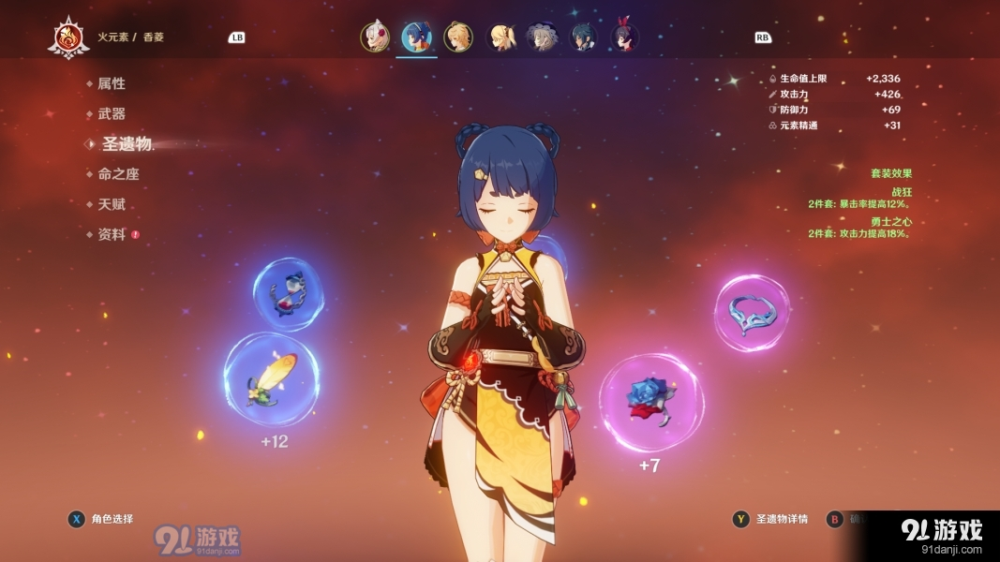
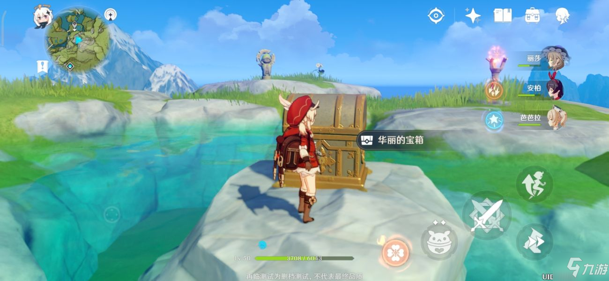

​																													原神简介

我要介绍的是的一款游戏《原神》。

#### 1.背景

这里是七种元素交汇的幻想世界“提瓦特”。

在遥远的过去，人们藉由对神灵的信仰，获赐了驱动元素的力量，得以在荒野中筑起家园。

五百年前，古国的覆灭却使得天地变异……

如今，席卷大陆的灾难已经停息，和平却仍未如期光临。

作为故事的主人公，你从世界之外漂流而来，降临大地。你将在这广阔的世界中，自由旅行、结识同伴、寻找掌控尘世元素的七神，直到与分离的血亲重聚 。

#### 2.人物

游戏开始时，玩家需在如下两个人物中选择一个开始游戏：

其中还有多种属性，各种属性还有多个人物，人物分为四星和五星，抽奖抽五星人物是该游戏一大玩点

.jpeg)

.jpeg)

#### 3.剧情

游戏里面剧情共分为三个部分，分别为蒙德，璃月，稻妻，三个部分又对应了三个地图，丰富了原神的世界观。

#### 4.地图

地图上面有很多锚点，打开之后可以进行传送，这也是玩这个游戏的一大乐趣，跑图开锚点，此外地图上还有许多boss可以打。

#### 5.联机

该游戏支持四人一起联机，我认为这是很吸引玩家的一点，玩家可以联机一起跑图打boss，极大的增大了游戏的趣味性。

#### 6.其他

除了人物之外还会有很多武器，圣遗物等等，游戏里面还有很多矿物，花草树木，虫鱼鸟兽都可以收集，矿物可以给装备升级，花草树木，虫鱼鸟兽可以做食物，食物会给人物增加属性。另外地图中到处分布着宝箱和小怪可以开和打，小怪打了之后也会掉落物品用于升级等等。

.jpeg)

